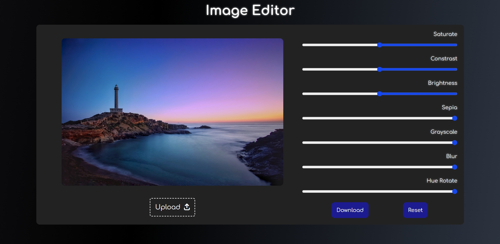

# Image Filter Application

A simple image editor built using HTML, CSS, and JavaScript that allows users to upload and manipulate images directly in their browser.

# My Project

Here’s a screenshot of the project:

## Overview

This application allows users to upload an image, apply various filters to it, and download the edited image. The filters include adjustments for saturation, contrast, brightness, sepia, grayscale, blur, and hue rotation. The application uses HTML, CSS, and JavaScript, with the image processing done on a canvas element.

## Features

- **Upload Image**: Users can upload an image from their device.
- **Apply Filters**: Users can adjust the following filters:
  - Saturation
  - Contrast
  - Brightness
  - Sepia
  - Grayscale
  - Blur
  - Hue Rotation
- **Reset Filters**: Resets all filters to their default values.
- **Download Image**: Downloads the edited image in its current state.

## Code Explanation

### HTML Elements

- **Filters**: Each filter is represented by an HTML `<input>` element with a unique ID.
  - `saturate`, `contrast`, `brightness`, `sepia`, `grayscale`, `blur`, `hue-rotate`
- **Buttons**: The buttons for uploading, downloading, and resetting are accessed via their IDs.
  - `upload`, `download`, `reset`
- **Image and Canvas**:
  - `imgBox`: A container for the image.
  - `img`: The image element where the uploaded image is initially displayed.
  - `canvas`: A canvas element where the image is drawn and manipulated.

### JavaScript Logic

- **Initialization (`window.onload`)**:

  - Hides the download, reset buttons, and the image container until an image is uploaded.

- **Reset Function (`resetValue`)**:

  - Resets all filter values to their default settings.

- **Image Upload (`upload.onchange`)**:

  - Resets the filters to their default values.
  - Displays the necessary UI elements.
  - Reads the uploaded file using a `FileReader`.
  - Displays the image and draws it on the canvas.

- **Filter Application**:

  - Listens for changes on any of the filter inputs and updates the canvas accordingly using the `ctx.filter` property.

- **Download Image (`download.onclick`)**:
  - Converts the canvas content to a data URL, which is used as the download link.

## How to Use

1. **Upload an Image**: Click the "Upload" button to select an image from your device.
2. **Apply Filters**: Use the sliders to adjust the image filters. The changes will be reflected in real-time.
3. **Download Image**: Once satisfied with the changes, click the "Download" button to save the edited image.
4. **Reset Filters**: If you want to start over, click the "Reset" button to restore the filters to their default settings.

## Notes

- The filters are applied in real-time as you adjust the sliders.
- The image is drawn on a canvas, which allows for the manipulation of the image data.
- The download button will download the image with the applied filters as a `.png` file.

## Dependencies

This project does not require any external libraries or dependencies. It runs purely on vanilla JavaScript, HTML, and CSS.

## License

This project is open-source and available for use and modification under the MIT License.
